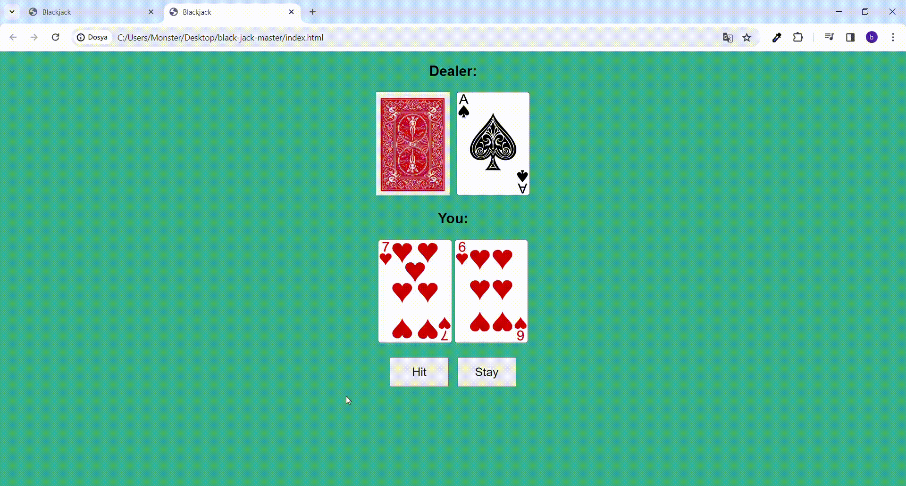

<h1>BLACKJACK</h1>

Welcome to the Blackjack game! The goal is to have a hand value as close to 21 as possible without exceeding it. Your opponent is the dealer. You can choose to ‘hit’ and draw another card or ‘stay’ and keep your current hand. If your hand is closer to 21 than the dealer’s hand without exceeding 21, you win! Display: “You Win!”. If the dealer busts (exceeds 21), you win as well. If your hand exceeds 21, you bust and lose. Display: “You Lose!”. If the dealer’s hand is closer to 21 than yours without exceeding 21, you lose. If both you and the dealer have the same hand value (including Blackjack), it’s a tie! Display: “Tie!”. Have fun playing Blackjack!

<h2> Software Languages </h2>

- HTML

- CSS

- JavaScript

<h2> Screen Gif </h2>

